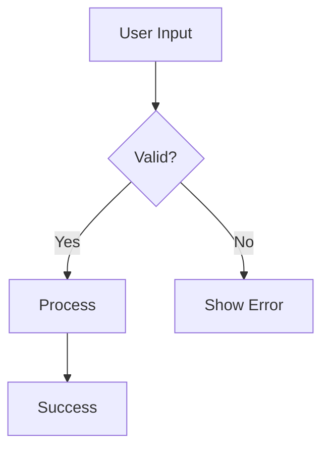

# AI-Friendly Documentation Guide for Docusaurus

This guide explains how to make your Docusaurus documentation more accessible and readable for AI systems like Claude, ChatGPT, and other LLMs.

## Why AI-Friendly Documentation Matters

AI systems can:
- Help users understand your framework faster
- Generate code examples automatically
- Answer questions about your API
- Provide better search and discovery
- Enable AI-powered IDE assistance

## Current Setup

Your documentation uses:
- **Docusaurus 3.0** - Modern documentation platform
- **TypeDoc** - Auto-generated API documentation from TypeScript
- **286 markdown files** - Comprehensive API coverage
- **89 classes** documented

## Recommended Plugins for AI Optimization

### 1. Enhanced Sitemap Plugin

**Purpose**: Helps AI crawlers understand your documentation structure

```bash
npm install --save-dev @docusaurus/plugin-sitemap
```

**Configuration** in `docusaurus.config.js`:

```javascript
plugins: [
  [
    '@docusaurus/plugin-sitemap',
    {
      changefreq: 'weekly',
      priority: 0.5,
      ignorePatterns: ['/tags/**'],
      filename: 'sitemap.xml',
    },
  ],
]
```

### 2. JSON-LD Structured Data Plugin

**Purpose**: Adds semantic metadata for AI understanding

```bash
npm install --save-dev docusaurus-plugin-structured-data
```

**Configuration**:

```javascript
plugins: [
  [
    'docusaurus-plugin-structured-data',
    {
      structuredData: {
        '@context': 'https://schema.org',
        '@type': 'SoftwareSourceCode',
        name: 'SUI-JS',
        description: 'Lightweight Frontend Framework in TypeScript',
        programmingLanguage: 'TypeScript',
        runtimePlatform: 'Browser',
        codeRepository: 'https://github.com/siposdani87/sui-js',
        license: 'https://opensource.org/licenses/ISC',
      },
    },
  ],
]
```

### 3. Search Plugin (Algolia DocSearch)

**Purpose**: Enables AI-powered semantic search

```bash
npm install --save-dev @docusaurus/plugin-search-local
```

**Alternative** (Better for AI): Use Algolia DocSearch

```javascript
themeConfig: {
  algolia: {
    appId: 'YOUR_APP_ID',
    apiKey: 'YOUR_API_KEY',
    indexName: 'sui-js',
    contextualSearch: true,
    searchParameters: {
      facetFilters: ['language:en', 'version:current'],
    },
  },
}
```

### 4. OpenGraph & Meta Tags Plugin

**Purpose**: Rich previews for AI and social platforms

Already built into Docusaurus, enhance in `docusaurus.config.js`:

```javascript
themeConfig: {
  metadata: [
    {name: 'keywords', content: 'typescript, framework, frontend, ui, components'},
    {name: 'og:type', content: 'website'},
    {name: 'og:description', content: 'Lightweight FE framework in TypeScript'},
    {name: 'twitter:card', content: 'summary_large_image'},
  ],
}
```

## Best Practices for AI-Readable Documentation

### 1. Structured Markdown Hierarchy

Use consistent heading structure:

```markdown
# Main Title (H1) - One per page

## Section (H2) - Main sections

### Subsection (H3) - Details

#### Minor heading (H4) - Specific details
```

**Why**: AI systems use heading hierarchy to understand document structure.

### 2. Frontmatter Metadata

Add metadata to every markdown file:

```markdown
---
id: application
title: Application Class
sidebar_label: Application
description: Main application class for initializing the SUI-JS framework
keywords:
  - application
  - initialization
  - configuration
  - routing
tags:
  - core
  - required
---
```

**Why**: Helps AI understand context and relationships.

### 3. Code Examples with Context

Always include:
- **Description** before code
- **Comments** in code
- **Expected output** after code

```markdown
## Creating an Application

Initialize the framework with configuration:

\`\`\`typescript
// Create application with basic config
const app = new Application({
  app_id: 'my-app',
  locale: 'en-GB',
  backend: 'https://api.example.com',
  production: false
});

// Expected: Application instance ready for routing
\`\`\`
```

### 4. Cross-References and Links

Use explicit, descriptive links:

```markdown
<!-- Bad -->
See [here](./classes/Application.md) for more.

<!-- Good -->
See the [Application class documentation](./classes/Application.md)
for initialization options and methods.
```

### 5. API Documentation Structure

For each class/function, include:

```markdown
## ClassName

**Purpose**: Brief one-line description

**Use Case**: When to use this class

### Constructor

\`\`\`typescript
constructor(config: ConfigOptions)
\`\`\`

**Parameters**:
- `config` (ConfigOptions): Application configuration object
  - `app_id` (string, required): Unique application identifier
  - `locale` (string, optional): Locale code (default: 'en-US')

**Example**:
\`\`\`typescript
const app = new Application({
  app_id: 'my-app',
  locale: 'en-GB'
});
\`\`\`

### Methods

#### run(routes: Route[], services: string[]): void

Starts the application with routing and services.

**Parameters**:
- `routes`: Array of route definitions
- `services`: Array of service names to initialize

**Returns**: void

**Example**:
\`\`\`typescript
app.run([
  { path: '/', controller: HomeController }
], ['http', 'auth']);
\`\`\`

**Related**:
- [Route Configuration](./route.md)
- [Service Registration](./services.md)
```

### 6. Table of Contents

Add ToC for long documents:

```markdown
## Table of Contents

1. [Installation](#installation)
2. [Configuration](#configuration)
3. [API Reference](#api-reference)
4. [Examples](#examples)
5. [Troubleshooting](#troubleshooting)
```

### 7. Decision Trees & Flowcharts

Use Mermaid diagrams (supported in Docusaurus):

````markdown

````

### 8. Comparison Tables

Make choices clear:

```markdown
## Form Field Types

| Field Type | Use Case | Input Type | Validation |
|------------|----------|------------|------------|
| TextField | Single-line text | text | string, regex |
| TextareaField | Multi-line text | textarea | string, maxLength |
| NumberField | Numeric input | number | min, max, step |
| DateField | Date selection | date | date range |
```

### 9. Warning & Info Boxes

Use admonitions (Docusaurus feature):

```markdown
:::note
This is a note for additional context.
:::

:::tip Pro Tip
Use this pattern for better performance.
:::

:::warning
This method is deprecated in v2.0.
:::

:::danger Breaking Change
This will be removed in v3.0. Use NewClass instead.
:::
```

### 10. Type Definitions

Include TypeScript type definitions:

```markdown
## Types

\`\`\`typescript
interface ConfigOptions {
  app_id: string;
  locale?: string;
  backend: string;
  production: boolean;
  theme?: 'light' | 'dark';
}

type Route = {
  path: string;
  controller: Controller;
  middleware?: Middleware[];
}
\`\`\`
```

## Enhanced Docusaurus Configuration

Update your `website/docusaurus.config.js`:

```javascript
const config = {
  title: 'SUI-JS',
  tagline: 'Lightweight Frontend Framework in TypeScript',
  url: 'https://sui-js.siposdani87.com',
  baseUrl: '/',

  // AI Optimization
  onBrokenLinks: 'throw', // Ensures all links work for AI crawlers
  onBrokenMarkdownLinks: 'throw',

  // Metadata for AI
  metadata: [
    {name: 'keywords', content: 'typescript, framework, frontend, ui, components, material-design'},
    {name: 'description', content: 'SUI-JS is a lightweight frontend framework written in TypeScript with 60+ UI components'},
    {name: 'og:type', content: 'website'},
    {name: 'og:description', content: 'Lightweight FE framework in TypeScript with Material Design components'},
    {name: 'twitter:card', content: 'summary_large_image'},
    {name: 'robots', content: 'index, follow'},
  ],

  plugins: [
    // Existing TypeDoc plugin
    [
      'docusaurus-plugin-typedoc',
      {
        entryPoints: ['../src/index.ts'],
        tsconfig: '../tsconfig.json',
        out: '.',
        // Enhanced for AI
        readme: 'none', // Avoid duplicate content
        excludePrivate: true,
        excludeProtected: true,
        excludeExternals: true,
      },
    ],

    // Add sitemap
    [
      '@docusaurus/plugin-sitemap',
      {
        changefreq: 'weekly',
        priority: 0.5,
      },
    ],
  ],

  presets: [
    [
      'classic',
      {
        docs: {
          sidebarPath: require.resolve('./sidebars.js'),
          // Enable versioning for AI to understand history
          lastVersion: 'current',
          versions: {
            current: {
              label: '1.0.1',
              path: '',
            },
          },
          // Edit links help AI understand source
          editUrl: 'https://github.com/siposdani87/sui-js/tree/master/website/',
        },
        blog: {
          showReadingTime: true,
          blogTitle: 'SUI-JS Blog',
          blogDescription: 'Updates and tutorials for SUI-JS framework',
        },
        theme: {
          customCss: require.resolve('./src/css/custom.css'),
        },
        // Enable sitemap generation
        sitemap: {
          changefreq: 'weekly',
          priority: 0.5,
        },
      },
    ],
  ],

  themeConfig: {
    // Enhanced navbar with AI-friendly structure
    navbar: {
      title: 'SUI-JS',
      logo: {
        alt: 'SUI-JS Logo',
        src: 'img/logo.svg',
      },
      items: [
        {
          type: 'doc',
          docId: 'index',
          position: 'left',
          label: 'Documentation',
        },
        {
          type: 'doc',
          docId: 'classes/Application',
          position: 'left',
          label: 'API Reference',
        },
        {to: '/blog', label: 'Blog', position: 'left'},
        {
          href: 'https://github.com/siposdani87/sui-js',
          label: 'GitHub',
          position: 'right',
        },
      ],
    },

    // Footer with structured information
    footer: {
      style: 'dark',
      links: [
        {
          title: 'Docs',
          items: [
            {label: 'Getting Started', to: '/docs/'},
            {label: 'API Reference', to: '/docs/classes/Application'},
            {label: 'Examples', to: '/docs/examples'},
          ],
        },
        {
          title: 'Community',
          items: [
            {label: 'GitHub', href: 'https://github.com/siposdani87/sui-js'},
            {label: 'Issues', href: 'https://github.com/siposdani87/sui-js/issues'},
            {label: 'NPM', href: 'https://www.npmjs.com/package/@siposdani87/sui-js'},
          ],
        },
      ],
      copyright: `Copyright © ${new Date().getFullYear()} Dániel Sipos. Built with Docusaurus.`,
    },
  },
};
```

## AI.txt / robots.txt Configuration

Create `website/static/ai.txt`:

```text
# AI.txt - Instructions for AI systems

# Project Information
Name: SUI-JS
Description: Lightweight frontend framework in TypeScript
Version: 1.0.1
Repository: https://github.com/siposdani87/sui-js
Documentation: https://sui-js.siposdani87.com

# Key Files for Understanding
- /docs/index: Overview and getting started
- /docs/classes/Application: Main application class
- /docs/modules: All exported modules
- package.json: Dependencies and metadata
- tsconfig.json: TypeScript configuration

# Code Examples
Examples located in: /example/
Main entry point: /src/index.ts

# API Reference
All classes documented in: /docs/classes/
All functions documented in: /docs/functions/

# How to Use
1. Install: npm install @siposdani87/sui-js
2. Import: import { Application } from '@siposdani87/sui-js'
3. Initialize: const app = new Application(config)
4. Run: app.run(routes, services)
```

Create `website/static/robots.txt`:

```text
User-agent: *
Allow: /
Allow: /docs/
Allow: /blog/

Sitemap: https://sui-js.siposdani87.com/sitemap.xml

# AI-specific user agents
User-agent: GPTBot
Allow: /

User-agent: ChatGPT-User
Allow: /

User-agent: ClaudeBot
Allow: /
```

## Creating an Index Document

Create `website/docs/ai-index.md`:

```markdown
---
id: ai-index
title: AI Reference Index
sidebar_label: AI Index
description: Structured index for AI systems
keywords: [index, reference, api, overview]
---

# SUI-JS AI Reference Index

This document provides a structured overview for AI systems to understand SUI-JS.

## Project Overview

**Name**: SUI-JS
**Type**: Frontend Framework
**Language**: TypeScript
**Version**: 1.0.1
**License**: ISC
**Package**: [@siposdani87/sui-js](https://www.npmjs.com/package/@siposdani87/sui-js)

## Core Concepts

### 1. Application Initialization
- [Application Class](./classes/Application.md) - Main entry point
- [Configuration](./configuration.md) - Setup options
- [Routing](./routing.md) - URL routing system

### 2. UI Components (60+)
- **Forms**: [TextField](./classes/TextField.md), [SelectField](./classes/SelectField.md), [DateField](./classes/DateField.md)
- **Layout**: [Header](./classes/Header.md), [Footer](./classes/Footer.md), [NavBar](./classes/NavBar.md)
- **Feedback**: [Flash](./classes/Flash.md), [Dialog](./classes/Dialog.md), [Confirm](./classes/Confirm.md)
- **Data**: [Table](./classes/Table.md), [Calendar](./classes/Calendar.md), [Pager](./classes/Pager.md)

### 3. Core Utilities
- [Knot](./classes/Knot.md) - DOM manipulation wrapper
- [Http](./classes/Http.md) - HTTP client
- [State](./classes/State.md) - State management
- [Router](./classes/Router.md) - Client-side routing

### 4. Module System
- [EventBus](./classes/EventBus.md) - Event communication
- [Depot](./classes/Depot.md) - Storage abstraction
- [Cookie](./classes/Cookie.md) - Cookie management

## Quick Start

\`\`\`typescript
import { Application, Route } from '@siposdani87/sui-js';

// 1. Configure
const config = {
  app_id: 'my-app',
  locale: 'en-GB',
  backend: 'https://api.example.com',
  production: false
};

// 2. Define routes
const routes: Route[] = [
  { path: '/', controller: HomeController },
  { path: '/about', controller: AboutController }
];

// 3. Initialize
const app = new Application(config);
app.run(routes, []);
\`\`\`

## Architecture

\`\`\`
SUI-JS Architecture
├── Core Layer (Knot, State, Router)
├── Module Layer (Http, EventBus, Storage)
├── Component Layer (60+ UI Components)
└── Field Layer (Form inputs and validation)
\`\`\`

## Common Use Cases

### Form Handling
[TextField](./classes/TextField.md) → [Form](./classes/Form.md) → [Http](./classes/Http.md) → Backend

### Navigation
[Router](./classes/Router.md) → [Route](./classes/Route.md) → [Controller](./common/Controller.md) → View

### Data Display
[Http](./classes/Http.md) → [Table](./classes/Table.md) → [Pager](./classes/Pager.md)

## All Classes Alphabetically

[See complete class index](./modules.md)

## Type Definitions

All TypeScript types are exported from the main package:

\`\`\`typescript
import type {
  ConfigOptions,
  Route,
  HttpOptions,
  StateOptions
} from '@siposdani87/sui-js';
\`\`\`

## Dependencies

- **crypto-js**: Cryptographic utilities
- **date-fns**: Date manipulation
- **material-design-lite**: UI styling
- **normalize.css**: CSS normalization

## Build Information

- **Bundler**: ESBuild
- **Output**: IIFE (global `SUI` object)
- **Size**: 242KB JS + 78KB CSS
- **Target**: ES2015+
- **Module**: ESNext

## Testing

- **Framework**: Jest 30.2.0
- **Coverage**: 52.5% statements, 34.96% branches
- **Test Files**: 95 suites, 180 tests

## Related Resources

- [GitHub Repository](https://github.com/siposdani87/sui-js)
- [NPM Package](https://www.npmjs.com/package/@siposdani87/sui-js)
- [Change Log](https://github.com/siposdani87/sui-js/blob/master/CHANGELOG.md)
- [Examples](https://github.com/siposdani87/sui-js/tree/master/example)
```

## Implementation Steps

1. **Install plugins**:
```bash
cd website
npm install --save-dev @docusaurus/plugin-sitemap
```

2. **Update configuration** in `docusaurus.config.js`

3. **Add metadata** to existing markdown files

4. **Create AI index** document

5. **Add ai.txt and robots.txt**

6. **Rebuild documentation**:
```bash
cd website
npm run build
```

## Measuring AI Readability

### Checklist

- [ ] Every page has frontmatter with title, description, keywords
- [ ] Consistent heading hierarchy (H1 → H2 → H3)
- [ ] Code examples have context and comments
- [ ] Cross-references use descriptive link text
- [ ] Sitemap.xml generated and accessible
- [ ] robots.txt allows AI crawlers
- [ ] Tables used for comparisons
- [ ] Mermaid diagrams for complex flows
- [ ] Type definitions included
- [ ] Related links provided

### Testing

Test your documentation with AI:

1. **Claude**: "Summarize the SUI-JS Application class"
2. **ChatGPT**: "Generate a form example using SUI-JS"
3. **GitHub Copilot**: Start typing SUI-JS code and check autocomplete

## Benefits

After implementing these improvements:

✅ **Better AI understanding** - Structured data helps AI grasp relationships
✅ **Improved code generation** - AI can generate accurate examples
✅ **Enhanced search** - Semantic search finds relevant docs
✅ **Faster onboarding** - AI assistants can answer questions quickly
✅ **Better IDE support** - Autocomplete and inline docs improve

## Maintenance

- Update ai.txt when releasing new versions
- Keep sitemap fresh by rebuilding docs regularly
- Add keywords to new documentation pages
- Monitor which pages AI systems access most (via analytics)

## Resources

- [Docusaurus Documentation](https://docusaurus.io/docs)
- [Schema.org Vocabulary](https://schema.org/SoftwareSourceCode)
- [OpenAI Best Practices](https://platform.openai.com/docs/guides/prompt-engineering)
- [Anthropic Documentation Tips](https://docs.anthropic.com/claude/docs)
