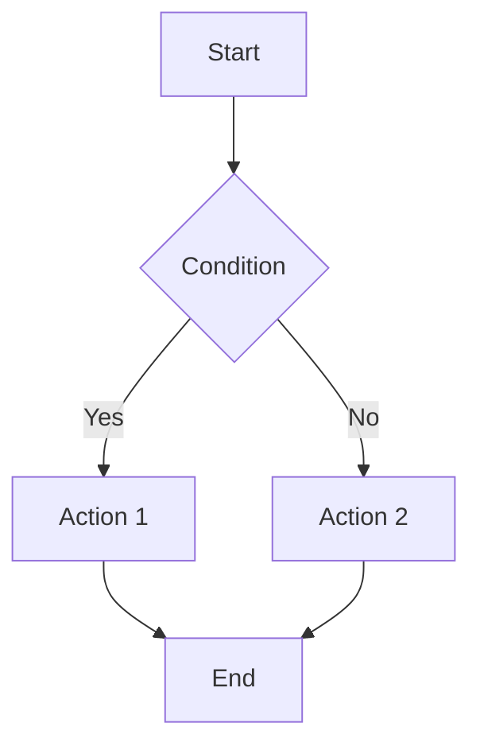
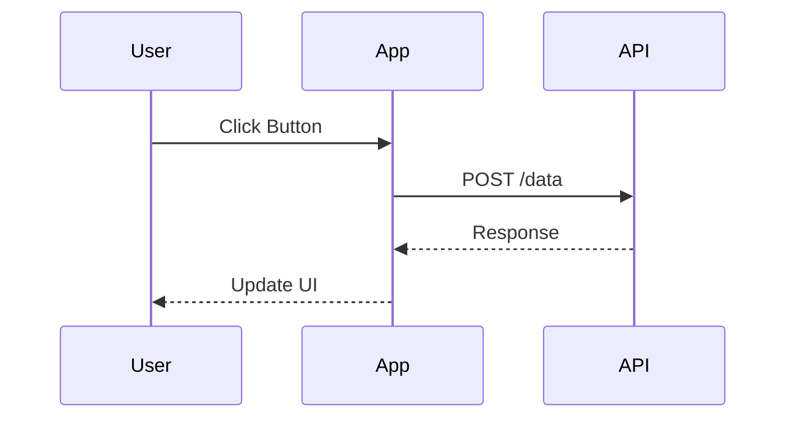
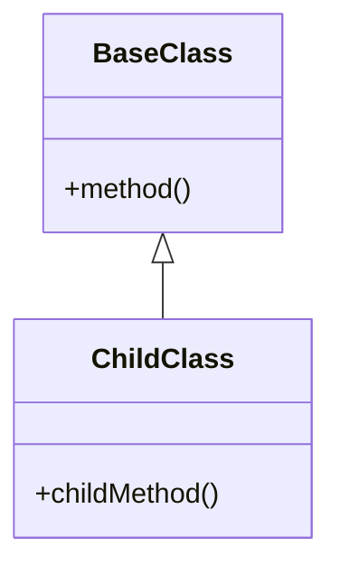

# Documentation Template for AI Optimization

Use this template when creating or updating documentation pages.

## Frontmatter (Required for all pages)

```markdown
---
id: unique-page-id
title: Human-Readable Page Title
sidebar_label: Short Label for Sidebar
description: Clear one-sentence description of what this page covers
keywords:
  - primary-keyword
  - secondary-keyword
  - related-term
tags:
  - category
  - feature-type
slug: /custom-url-slug (optional)
---
```

## Page Structure

### 1. Title and Introduction

```markdown
# ClassName or Feature Name

**Package**: `@siposdani87/sui-js`
**Module**: `component` | `field` | `module` | `core` | `utils`
**Since**: v1.0.0

Brief description of what this class/feature does and when to use it.

## Use Cases

- Use case 1: Description
- Use case 2: Description
- Use case 3: Description

## Related Classes

- [RelatedClass1](./RelatedClass1.md) - Relationship description
- [RelatedClass2](./RelatedClass2.md) - Relationship description
```

### 2. Installation (if standalone)

```markdown
## Installation

\`\`\`bash
npm install @siposdani87/sui-js
\`\`\`

## Import

\`\`\`typescript
import { ClassName } from '@siposdani87/sui-js';
// or
import { ClassName } from '@siposdani87/sui-js/module';
\`\`\`
```

### 3. Quick Example (Always include)

```markdown
## Quick Example

\`\`\`typescript
// Brief description of what this example does
const instance = new ClassName(options);

// Show the most common usage
instance.commonMethod(param);

// Show result or next step
// Result: Expected outcome
\`\`\`
```

### 4. Constructor

```markdown
## Constructor

### new ClassName(param1, param2?)

Creates a new instance of ClassName.

**Parameters:**

| Name | Type | Required | Default | Description |
|------|------|----------|---------|-------------|
| param1 | string | Yes | - | Description of param1 |
| param2 | Options | No | {} | Configuration options |

**Options Object:**

\`\`\`typescript
interface Options {
  option1: string;        // Description
  option2?: number;       // Optional description (default: 10)
  option3?: boolean;      // Optional description (default: false)
}
\`\`\`

**Example:**

\`\`\`typescript
// Basic usage
const instance = new ClassName('value');

// With options
const instance = new ClassName('value', {
  option1: 'custom',
  option2: 20
});
\`\`\`

**Throws:**
- `Error` - When param1 is invalid
```

### 5. Methods

```markdown
## Methods

### methodName(param: Type): ReturnType

Brief description of what this method does.

**Parameters:**

| Name | Type | Required | Description |
|------|------|----------|-------------|
| param | Type | Yes | Parameter description |

**Returns:**
- `ReturnType` - Description of return value

**Example:**

\`\`\`typescript
// Example usage with context
const result = instance.methodName(value);
console.log(result); // Expected output
\`\`\`

**Throws:**
- `Error` - When parameter is invalid

**See Also:**
- [RelatedMethod](#relatedmethod) - Related functionality
```

### 6. Properties

```markdown
## Properties

### propertyName: Type

Description of the property and its purpose.

**Type:** `Type`
**Access:** `public` | `readonly` | `private`
**Default:** Default value

**Example:**

\`\`\`typescript
const value = instance.propertyName;
\`\`\`
```

### 7. Events (if applicable)

```markdown
## Events

### eventName

Fired when something happens.

**Event Data:**

\`\`\`typescript
interface EventData {
  property1: Type;
  property2: Type;
}
\`\`\`

**Example:**

\`\`\`typescript
instance.on('eventName', (data: EventData) => {
  console.log(data.property1);
});
\`\`\`
```

### 8. Complete Example

```markdown
## Complete Example

Here's a comprehensive example showing common usage patterns:

\`\`\`typescript
import { ClassName, RelatedClass } from '@siposdani87/sui-js';

// 1. Initialize with configuration
const instance = new ClassName('app', {
  option1: 'value',
  option2: true
});

// 2. Use main functionality
instance.mainMethod(data);

// 3. Listen to events
instance.on('change', (event) => {
  console.log('Changed:', event.value);
});

// 4. Handle errors
try {
  const result = instance.riskyMethod();
} catch (error) {
  console.error('Operation failed:', error);
}

// 5. Cleanup
instance.destroy();
\`\`\`

**Expected Output:**
\`\`\`
Changed: new-value
Operation completed successfully
\`\`\`
```

### 9. Common Patterns

```markdown
## Common Patterns

### Pattern 1: Use Case Name

\`\`\`typescript
// Description of the pattern
const instance = new ClassName(config);
instance.method1();
instance.method2();
\`\`\`

### Pattern 2: Another Use Case

\`\`\`typescript
// Description of another pattern
const result = ClassName.staticMethod(param);
\`\`\`
```

### 10. Best Practices

```markdown
## Best Practices

:::tip Performance
Use this approach for better performance in large applications.
:::

:::warning Common Mistake
Avoid doing X because it leads to Y problem.
:::

:::note Memory Management
Remember to call `destroy()` to prevent memory leaks.
:::

**Do:**
- ✅ Initialize once and reuse
- ✅ Handle errors appropriately
- ✅ Clean up resources

**Don't:**
- ❌ Create multiple instances unnecessarily
- ❌ Ignore error handling
- ❌ Forget to clean up
```

### 11. Troubleshooting

```markdown
## Troubleshooting

### Error: "Something went wrong"

**Cause:** Description of what causes this error

**Solution:**
\`\`\`typescript
// Corrected code
const fixed = new ClassName(correctParams);
\`\`\`

### Common Issue: Feature not working

**Check:**
1. Step 1 to verify
2. Step 2 to verify
3. Step 3 to fix

**Example Fix:**
\`\`\`typescript
// Working example
\`\`\`
```

### 12. Type Definitions

```markdown
## Type Definitions

\`\`\`typescript
// Main class
class ClassName {
  constructor(param: string, options?: Options);
  method(param: Type): ReturnType;
  property: PropertyType;
}

// Configuration interface
interface Options {
  option1: string;
  option2?: number;
}

// Type aliases
type CallbackFn = (data: EventData) => void;
\`\`\`
```

### 13. API Reference

```markdown
## API Reference

### Constructor

| Signature | Description |
|-----------|-------------|
| `new ClassName(param)` | Basic initialization |
| `new ClassName(param, options)` | With configuration |

### Methods

| Method | Return Type | Description |
|--------|-------------|-------------|
| `method1(param)` | void | Method description |
| `method2()` | Type | Method description |

### Properties

| Property | Type | Access | Description |
|----------|------|--------|-------------|
| `prop1` | string | readonly | Property description |
| `prop2` | number | public | Property description |
```

### 14. Related Documentation

```markdown
## Related Documentation

- [Getting Started Guide](./getting-started.md)
- [API Reference](./api-reference.md)
- [Examples](./examples.md)

### Related Classes

- [ParentClass](./ParentClass.md) - Base class
- [RelatedClass](./RelatedClass.md) - Used together
- [AlternativeClass](./AlternativeClass.md) - Alternative approach

### External Resources

- [MDN: Related Web API](https://developer.mozilla.org/en-US/docs/Web/API/...)
- [TypeScript Handbook](https://www.typescriptlang.org/docs/handbook/...)
```

### 15. Version History

```markdown
## Version History

| Version | Changes |
|---------|---------|
| 1.0.1 | Bug fixes |
| 1.0.0 | Initial release |

:::warning Deprecated
The old `oldMethod()` is deprecated. Use `newMethod()` instead.
:::
```

## Checklist for AI-Optimized Documentation

Before publishing, verify:

- [ ] Frontmatter includes: id, title, description, keywords, tags
- [ ] Heading hierarchy is correct (H1 → H2 → H3)
- [ ] Code examples have contextual descriptions
- [ ] All parameters documented with types
- [ ] Return types specified
- [ ] Practical examples included
- [ ] Error cases documented
- [ ] Cross-references added
- [ ] Tables used for comparisons
- [ ] Admonitions used for warnings/tips
- [ ] Type definitions provided
- [ ] Related documentation linked

## Mermaid Diagram Examples

### Flow Diagram

````markdown

````

### Sequence Diagram

````markdown

````

### Class Diagram

````markdown

````

## Code Block Languages

Use appropriate language tags:

- `typescript` - For TypeScript code
- `javascript` - For JavaScript code
- `bash` - For shell commands
- `json` - For JSON data
- `html` - For HTML markup
- `css` - For stylesheets
- `text` - For plain text output

## Following This Template

1. Copy this template
2. Fill in all sections relevant to your class/feature
3. Remove sections that don't apply
4. Add custom sections as needed
5. Verify checklist before committing
