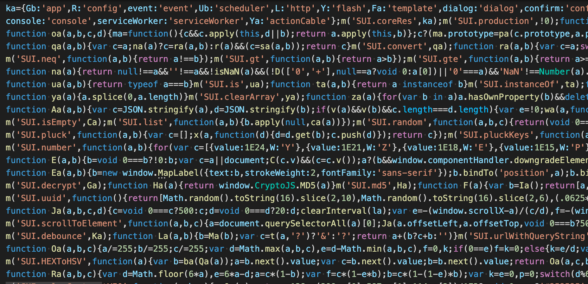

[SUI-JS](https://sui-js.siposdani87.com) frontend framework is powered by the [TypeScript](https://www.typescriptlang.org/).

The codebase was documented with JSDoc and compiled with ESbuild advanced settings. In this framework there are a lot of predefined UI components.

It is production ready framework, I use it on my hobby project [TrophyMap](https://trophymap.org).

There are many built-in features like:

- controllers and services with DI injections
- storage handlers
- form and input fields with errors
- route and states
- event management
- life-cycle hooks
- http requests
- UI components (navigation, toolbar, footer, layout, leftMenu, modal, card, table, tabs, buttons, basic materialUI)
- dynamic assets loading
- light/dark theme and customized color palette

The legacy version of SUI-JS was written in Vanilla JavaScript. It is documented and annotated with JSDoc, these options were needed to Google Closure Compiler - Advanced compilation, so the next image shows you minfied version of this JS bundle.

The framework now supports Esbuild!

**And if you want to use this framework**: just try it, and you have an issue with it, please contact with me.
